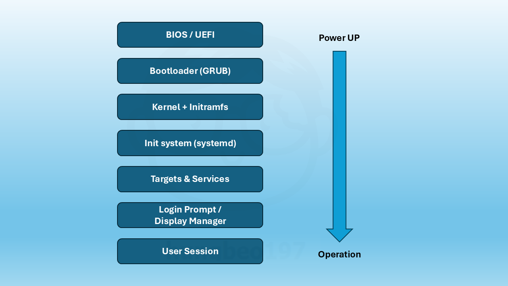
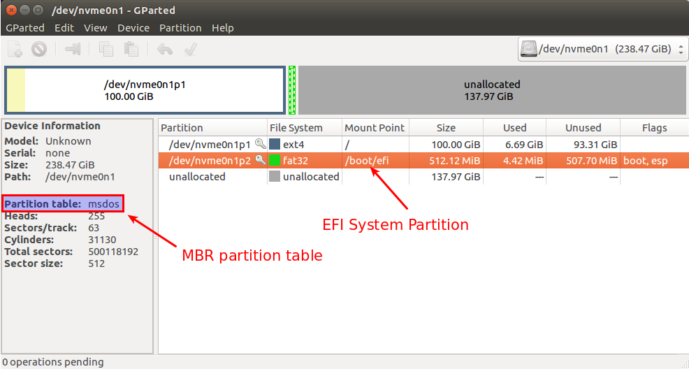
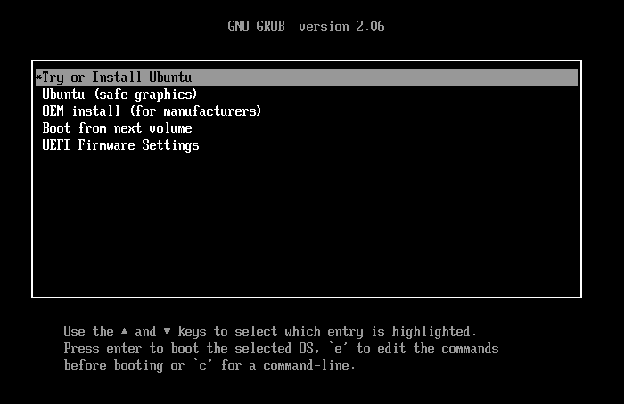

Gần đây, do yêu cầu của khách hàng, mình phải update OS (hệ điều hành) liên tục. Dạo gần đây, mình khá là chú ý đến cách hoạt động của Linux. Và đặc biệt, có rất nhiều những hệ thống nhỏ, thiết bị nhỏ xung quanh mình cũng sử dụng cơ chế hoạt động của Linux.

Vì vậy, mình quyết định tìm hiểu sâu hơn về hệ thống Linux, và mình note lại kiến thức đó vào blog này.

OK, bắt tay vào tóm tắt nào.

Khi Linux khởi động, hệ thống trải qua một chuỗi các bước theo thứ tự cụ thể gọi là **Linux boot process**. Nó được chạy theo thứ tự dưới đây.



Mình sẽ giải thích chi tiết thêm về từng bước khởi động của Linux.

## **1. BIOS / UEFI**

**BIOS (Legacy)** và **UEFI** là phần mềm firmware của máy tính. Mỗi máy tính đều có BIOS hoặc UEFI, dùng để quản lý phần cứng của máy tính. Nó kiểm tra phần cứng như: RAM, CPU, ổ cứng, ... bằng POST (Power-On Self Test). Sau đó, nó sẽ tìm **bootloader** từ thiết bị khởi động (Boot device) như ổ cứng, USB, để truy cập vào OS.

Khi bạn sử dụng hệ điều hành Linux, hay bạn gặp trục trặc về vấn đề khởi động, bạn có thế sử dụng USB hoặc DVD media để vào rescure mode. Sử dụng chế độ rescure mode từ media ngoài để chạy console. Từ console bạn gõ câu lệnh dưới để biết được máy tính của bạn đang sử dụng BIOS hay UEFI.
```
[ -d /sys/firmware/efi ] && echo "UEFI" || echo "BIOS"
```

## **2. Bootloader (GRUB/LILO)**

**GRUB (GRand Unified Bootloader)** là bootloader phổ biến nhất trên Linux. Vì tính phổ biến của nó, nên bài viết này mình chỉ tập trung nói về GRUB thôi nhé. 

GRUB khi hoạt động được chia thành **2 stage** chính:

### **Stage 1 (MBR, EFI Partition)**
* Vị trí: MBR (đối với BIOS) hoặc EFI System Partition (ESP) (đối với UEFI).
* Chức năng: rất nhỏ (~512 byte), chỉ để tìm và nạp Stage 2.

    

    Mình lấy một hình ở trên mạng. Bạn có thể thấy hệ thống trên đang chạy ở UEFI mode. Và dung lượng của EFI System Partition vô cùng nhỏ. Trong đó chứa nhưng file cần thiết để chạy và nạp State 2.

### **Stage 2 (Full GRUB config)**
* Vị trí: nằm trên ổ đĩa, thường là trong ```/boot/grub/```.
* Chức năng: 
  * Hiển thị menu boot (chọn hệ điều hành, kernel version).
  * Tải kernel (```/boot/vmlinuz-*```) và ```initrd/initramfs```.
  * Chuyển quyền điều khiển cho kernel.

Bootloader có nhiệm vụ tải nhân Linux (hay còn gọi là kernel) vào trong bộ nhớ. Và nếu máy tính của bạn có nhiều hệ điều hành, bạn có thể thấy được menu GRUB như hình dưới đây.



## **3. Kernel (nhân Linux)**
GRUB sẽ tải **kernel** cùng với **initramfs** (bộ nhớ ảo tạm thời). Sau đó, Kernel quản lý toàn bộ phần cứng và bắt đầu quá trình khởi tạo hệ thống. Sau đó, kernel chuyển quyền điều khiển cho init process.

## **4. init / systemd (Quá trình init đầu tiên)**
Làm hệ thống nhiều, sử dụng hệ thống nhiều nhưng ít ai để ý rằng **init** là viết tắt của **initiate** (bắt đầu, khởi tạo). Trước đây, các hệ thống cũ vẫn dùng init, cụ thể hơn là init.d. Nhưng hiện nay phần lớn Linux dùng systemd làm init system chính. 

systemd là PID 1, tiến trình đầu tiên chạy sau kernel. Thường khi systemd khởi động, nó sẽ khởi động các services, mount hệ thống file, thiết lập mạng, và những phần khác nằm trong máy tính.

## **5. Services và Target (or Runlevel)**
systemd thực hiện các target (tương tự runlevel trước đây). Ví dụ:
* graphical.target: chế độ đồ họa
* multi-user.target: chế độ dòng lệnh cho nhiều user
Sau đó, các service như network, sshd, cron, ... được bật tại đây.

## **6. Login Prompt / Display Manager**
Nếu dùng giao diện GUI cho Linux, display manager được chạy (GDM, LightDM, ...) và hiện màn hình login. Còn nếu không dùng GUI cho Linux, login prompt được chạy, và hiện màn hình đen cùng dòng lệnh như các hacker mà bạn xem trên phim đó.

## **7. User Session**
Sau khi đăng nhập, hệ thống khởi tạo shell hoặc môi trường desktop cho user như: bash, GNOME, KDE, ... .


Khi tất cả được khởi động xong xuôi, bạn có thể kiểm tra xem dịch vụ đang khởi động như thế nào với câu lệnh dưới đây:
```
systemctl list-units --type=service --state=running
```

Đó là những thông tin mình thấy cơ bản, cần note lại để hiểu, sử dụng cho công việc hiện tại cũng như sau này, thỏa mãn tính hay thắc mắc của mình bấy lâu nay.
